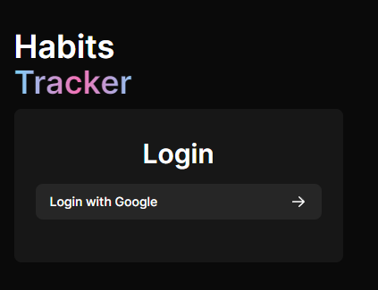

# Habit Tracker @ https://habits-app-azure.vercel.app/

## The Project

  

### About

This is a full-stack, CRUD, web app written in **TypeScript**, using **React** with the **Next.js** framework. On the back-end, I used **PostgreSQL** for the database, **Prisma** to interact with the database, and *Google **OAuth*** using *NextAuth.js* for a secure authentication.

The application itself is a re-creation of the <a href = "https://loophabits.org/">Loop Habit Tracker</a> app on Android. I really like using the app and figured it would be a great starting point to work on my web-development skills. 

My application allows users to Login, Create Habits, Delete Habits, and Track their progress daily. All the data is saved to a *PostgreSQL* database hosted on *Vercel*. I intend to add more to this application, including a statistics page to visualize user progress and general improvements to navigation.

### Purpose

The project was a way for me to learn how to make a full-stack web application. I have never used any of these technologies before and was excited to finally create a website. All the technologies listed above were my *first* time using them. 

### Hosting

The application is deployed on ***Vercel***.
You can access the live website at this link:
<a href="https://habits-app-azure.vercel.app/" target="_blank">Habit Tracker</a>

## Usage

1. Visit the <a href="https://habits-app-azure.vercel.app/" target="_blank">Habit Tracker</a>

### New Users

1. On the website, you will be prompted to login with Google.
2. Once you login, you be directed to the /habits page. Here you can create a new habit by clicking the plus icon at the top right.
3. Once you name your habit and select your color. Click save, and you will be redirected to the /habits page.
4. Here you can hover over your habit to see a tooltip showing the description of your habit. The tooltip also shows a button for you to delete your habit.
5. You can mark your habit progress by clicking the x-icons under the dates. They change to colored check-icons, to signifiy your successful completion of the habit for that day.

### Returning Users

1. If you're a returning user, you can either sign out or go to the track my habits page.
